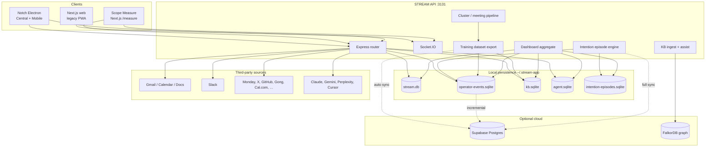

# STREAM / Notch

**STREAM** is an ambient AE/FDE copilot and signal platform. **Notch** is its desktop shell — a native macOS Electron app where operators work (feed, meetings, compose, clients). **Scope Measure** is a separate web dashboard for live observability, training corpus health, and behavioral-intention analytics.

The system unifies integrations into one stream, captures operator behavior for FDE baseline training, extracts meeting intelligence, routes compose actions to connected tools, and builds a personal knowledge graph — with optional cloud backup to Supabase and a property graph in FalkorDB.

---

## Table of contents

1. [Purpose](#purpose)
2. [Architecture](#architecture)
3. [Applications](#applications)
4. [Quick start](#quick-start)
5. [Scope Measure dashboard](#scope-measure-dashboard)
6. [What we collect](#what-we-collect)
7. [Storage & memory](#storage--memory)
8. [Docker — what it is for](#docker--what-it-is-for)
9. [APIs](#apis)
10. [Integrations & compose actions](#integrations--compose-actions)
11. [Observability & evals](#observability--evals)
12. [Hosting & deployment](#hosting--deployment)
13. [Environment variables](#environment-variables)
14. [Related docs](#related-docs)

---

## Purpose

Notch is built for **Forward Deployed Engineers (FDEs)** and account executives who live across Gmail, Slack, Monday, calls, and AI assistants. The product goals:

| Goal | How |
|------|-----|
| **Single work surface** | X-style central feed + calendar portal + mobile cluster assist during calls |
| **Capture real operator behavior** | Unified operator events (impression → dwell → select → compose → submit) |
| **Meeting → action** | Live transcript, signals, starred moments, post-call extraction, task routing |
| **Client ledger** | Engagements (intake → build → maintenance) with decision timeline |
| **Training corpus** | Correlated task sessions, meeting snapshots, action traces for baseline models |
| **Behavioral intention** | Episodes with reaction speed, event chains, commitment depth, intention weight |
| **Assist & memory** | Personal KB (entities, datapoints, GraphRAG-lite retrieval) + optional FalkorDB graph |

Scope Measure answers: *“What is being measured, stored, and gathered right now?”* — without opening the Electron app.

---

## Architecture



**Data flow (simplified):**

1. Integrations sync into `stream.db` → KB pipeline ingests datapoints/entities.
2. Notch UI emits operator events → SQLite → intention engine closes episodes → dashboard + Supabase.
3. Meetings produce signals, starred moments, predictions, decisions → FDE training store (`kb.sqlite`).
4. Compose actions record action traces with inferred intention vectors.
5. Scope Measure reads aggregates via `GET /api/dashboard/data` (computed from DB, not cached separately).

---

## Applications

| App | Command | URL / access | Role |
|-----|---------|--------------|------|
| **Notch (live)** | `npm run dev:notch:live` | Electron → `localhost:5174` | Production FDE prototype: real OAuth, live meeting pipeline |
| **Notch (demo)** | `npm run dev:notch:demo` | Electron | Acme simulation + canned assist |
| **Notch (default dev)** | `npm run dev:notch` | Electron | API + Vite + Electron (simulation-friendly) |
| **Scope Measure** | `npm run dev:measure` or `dev:web` + shared API | `http://localhost:3000/measure` | Live data dashboard (requires API on `:3131`) |
| **Ambient (legacy)** | `npm run dev:ambient` | Electron | Earlier ambient macOS experiment |
| **Next web** | `npm run dev:web` | `http://localhost:3000` | Marketing/download pages, legacy PWA at `/` |
| **API only** | `npm run dev:api` | `http://localhost:3131` | Express + Socket.IO |

**Important:** Notch is **desktop-only** for the product shell — do not use the browser for Central/Mobile cluster UX. See [notch/README.md](notch/README.md).

**Recommended dev pairing (one API, two UIs):**

```bash
npm run dev:notch:live   # API :3131 + Notch Electron
npm run dev:web          # Measure at :3000 (proxies /api → :3131)
```

---

## Quick start

```bash
npm install
cp .env.example .env.local   # fill OAuth + API keys as needed
npm run dev:notch:live         # Notch + API
npm run dev:web                # Scope Measure (optional, separate terminal)
```

Docker is **optional** — only for local FalkorDB graph memory; see [Docker — what it is for](#docker--what-it-is-for).

Open Measure: [http://localhost:3000/measure](http://localhost:3000/measure)

**Production Measure** (`appliedscope.com`) reads your Mac via a permanent Cloudflare Tunnel:

```bash
npm run setup:stream-tunnel    # once — api.appliedscope.com → :3131
npm run sync:measure-vercel      # point Vercel at the stable URL
npm run dev:notch:live:stream    # Notch + tunnel together
npm run install:stream-tunnel-agent   # optional: tunnel at login (macOS)
```

See [measure-site/README.md](measure-site/README.md) for details.

For FDE onboarding (real Gmail, Monday, MCP): [docs/FDE_HANDOFF.md](docs/FDE_HANDOFF.md).

For macOS release builds: [docs/NOTCH_RELEASE.md](docs/NOTCH_RELEASE.md).

---

## Scope Measure dashboard

**Route:** `/measure`  
**API:** `GET /api/dashboard/data?since=<ms>` (Next.js rewrites to Express)  
**Live updates:** Socket.IO `dashboard:activity`, `dashboard:episode`, `stream:item`; 10s polling refreshes counts/stats.

### Sections

| Section | What it shows | Source of truth |
|---------|---------------|-----------------|
| **Overview counts** | Stream items, operator events, engagements, KB entities/edges, graph stats, FDE corpus, agents, training sessions, Supabase configured | SQL counts across local DBs |
| **Intention episodes** | Behavioral weight, outcomes, reaction tiers, top event chains (sample), reaction-by-source | `intention-episodes.sqlite` |
| **Insights** | Stream by source, intention mix (compose traces), agent pipeline, action traces, engagements, task sessions, FDE decisions | KB + agent + telemetry + FDE stores |
| **Moments** | Starred moments, meeting signals, assist predictions, recent meetings | FDE training store |
| **Live activity** | Merged feed of recent events (incremental when `since` set) | Ephemeral merge; each item persisted at ingest |

### Accuracy principles

- Stat cards refresh from **server polls only** (live sockets update activity/episodes, not inflated counts).
- Aggregates are **computed from persisted rows**, not stored as separate snapshot tables.
- Sampled metrics (e.g. top chains, avg reaction time) label their sample size in the UI.
- Supabase status = **credentials configured**, not “last sync time”.

Key files: `app/measure/page.tsx`, `hooks/useDataDashboard.ts`, `server/dashboard/aggregate.ts`, `server/dashboard/insights.ts`, `shared/dashboard.ts`.

---

## What we collect

### 1. Stream items

Unified feed from connected sources (Gmail, Slack, X, Monday, Discord, GitHub, Gong, Cal.com, Claude, Gemini, Perplexity, meetings, notes).

- **Events:** new/updated items, read/star state
- **Storage:** `~/.stream-app/stream.db` → `stream_items`

### 2. Operator events

Fine-grained UI telemetry from Notch (and server-emitted events).

| Type | Meaning |
|------|---------|
| `feed_impression` | Item entered viewport |
| `feed_dwell` | Time on item |
| `feed_vote` | Up/down/clear |
| `feed_context_select` | Item selected for compose context |
| `feed_thread_open` | Thread expanded |
| `compose_start` / `compose_submit` | Compose funnel |
| `nav_change`, `panel_toggle` | Navigation |
| `meeting_start` / `meeting_end` | Call lifecycle |
| `task_session_start` / `task_session_end` | Correlated work blocks |
| `agent_proposal_*` | Agent inbox pipeline |

- **Storage:** `operator-events.sqlite`
- **Cloud:** `operator_events` table (Supabase, incremental upsert)
- **Types:** `shared/operator-events.ts`

### 3. Intention episodes (behavioral intention)

Derived artifacts linking stimulus → reaction chain → outcome.

- **Inputs:** operator events, meeting signals, starred moments
- **Fields:** event chain, latencies (reaction / commitment / dwell), commitment depth, behavioral weight, reaction tier, text intention vector
- **Storage:** `intention-episodes.sqlite`
- **Cloud:** `intention_episodes` table (full sync on post-meeting / manual training sync)
- **Engine:** `server/intention/episodeEngine.ts` (v2)

### 4. Personal knowledge base

Ingested from stream + compose + ontology config.

- **Datapoints** — normalized text chunks per stream item
- **Entities & edges** — people, topics, concepts, relations
- **Action traces** — compose executions with `timeToActionMs`, outcome, intention blend
- **Storage:** `kb.sqlite` (shared file with FDE tables)
- **Retrieval:** GraphRAG-lite (lexical + graph boost); pgvector slot documented for later

### 5. FDE training corpus

Meeting and engagement lifecycle for baseline model work.

| Record | Contents |
|--------|----------|
| Meeting records | Session metadata, duration, chunk/signal counts |
| Meeting chunks | Transcript segments |
| Meeting signals | Live extraction during calls |
| Starred moments | Operator-flagged highlights |
| Assist predictions | “Say this” suggestions + flags |
| Decision events | Phase transitions (discovery, build, scope approve, …) |
| Requirements / revisions | Extracted scope artifacts |
| Engagements | Client ledger (stage, scope bucket, escalation) |
| Build runs | Executor, prompt, status, trace blob |
| Feedback | FDE retro labels |

- **Storage:** `kb.sqlite` (FDE tables in same DB)
- **Cloud:** `fde_meeting_snapshots`, `fde_training_sessions`
- **Export:** `GET /api/training/dataset`

### 6. Agent proposals

Inbound agent messages (e.g. LinkedIn-style booking flows) with approval workflow.

- **Storage:** `agent.sqlite`
- **Cloud:** `agent_proposals`, `agent_interaction_log`
- **Export:** `GET /api/agent/training/export`

### 7. Property graph (optional)

Deals, requirements, meetings, session signals synced to FalkorDB for Cypher queries and feed ranking.

- **Local adapter:** `server/graph/store.ts` (in-memory fallback)
- **Remote:** FalkorDB via `FALKORDB_*` env vars
- **Sync:** `server/graph/syncService.ts`

---

## Storage & memory

Default data directory: `~/.stream-app` (override with `STREAM_DATA_DIR`).

| File | Contents |
|------|----------|
| `stream.db` | Stream feed items |
| `operator-events.sqlite` | Operator telemetry |
| `kb.sqlite` | KB entities, datapoints, edges, traces, **and** FDE training tables |
| `agent.sqlite` | Agent proposals + interaction log |
| `intention-episodes.sqlite` | Behavioral intention episodes |
| `mcp-agents.json` | Registered MCP agent definitions |
| OAuth tokens | Per-integration token stores under data dir |

### Supabase (cloud backup)

Run migrations in order:

1. `supabase/migrations/001_operator_capture.sql`
2. `supabase/migrations/002_agent_proposals.sql`
3. `supabase/migrations/003_fde_meeting_corpus.sql`
4. `supabase/migrations/004_intention_episodes.sql`

**Sync triggers:**

- Operator events → incremental on ingest
- Intention episodes → incremental on each upsert; bulk on post-meeting / manual training sync
- Post-meeting → meeting snapshot + training sessions + all intention episodes
- Manual → `POST /api/training/sync` (response includes `intentionEpisodesSynced`)

Set `SUPABASE_SYNC_DISABLED=1` to disable auto sync.

### What is *not* persisted

- Dashboard snapshot JSON (rebuilt on each request)
- Live activity merge buffer (entries exist in source tables)
- Socket.IO session state
- In-memory graph when FalkorDB disabled (rebuilt from SQLite/engagements)

---

## Docker — what it is for

**TL;DR:** The only Docker setup in this repo runs **FalkorDB** — an optional property graph database. It does **not** run Notch, the STREAM API, Next.js, Scope Measure, or Supabase. You do not need Docker to develop or use the product unless you want the graph layer locally.

### Why Docker exists here

Notch keeps its **source of truth in SQLite** (`stream.db`, `kb.sqlite`, etc.). Separately, the app can mirror deals, engagements, requirements, KB entities, and edges into a **graph** for:

- Cypher-style queries (`server/graph/queryService.ts`)
- Feed ranking / GraphRAG-lite boosts (`server/graph/feedRanker.ts`, `server/kb/pipeline.ts`)
- Scope Measure “Graph edges” stats when connected

[FalkorDB](https://www.falkordb.com/) is a Redis-module graph DB. The repo ships one compose file so you can spin it up locally without installing FalkorDB by hand.

**File:** `docker-compose.falkordb.yml` — single service `falkordb/falkordb:latest`, port **6380→6379** (6380 avoids clashing with Homebrew Redis on 6379), data in Docker volume `falkordb_data`.

### What Docker is *not* for

| You might expect… | Reality |
|-------------------|---------|
| `docker compose up` runs the whole stack | **No** — run `npm run dev:notch:live` / `dev:measure` on the host |
| Docker replaces SQLite | **No** — SQLite remains primary; FalkorDB is a sync target |
| Docker runs Postgres/Supabase | **No** — use Supabase Cloud + SQL migrations |
| Required for meetings, feed, or dashboard | **No** — all work without FalkorDB |

### When to use it

- You want **local graph queries** and FalkorDB node/edge counts on Measure.
- You are testing **graph sync** after post-call engagement upserts (`server/graph/syncService.ts`).
- You prefer a local graph over **FalkorDB Cloud** (free tier) for dev.

### When to skip it

- Default FDE workflow (feed, meetings, training corpus, Supabase backup) — graph is optional.
- Set `FALKORDB_DISABLED=1` or leave `FALKORDB_*` unset; the app uses SQLite + in-memory graph adapters.

### Start / stop

```bash
# Start FalkorDB in the background
docker compose -f docker-compose.falkordb.yml up -d

# Confirm it is listening
docker compose -f docker-compose.falkordb.yml ps
```

Add to `.env.local`:

```env
FALKORDB_URL=redis://localhost:6380
FALKORDB_GRAPH=notch
FALKORDB_ENABLED=1
```

Restart the STREAM API so it connects. Measure shows **Falkor connected** under graph stats when `pingFalkor()` succeeds.

```bash
# Stop (keeps data in volume)
docker compose -f docker-compose.falkordb.yml down

# Stop and wipe graph data
docker compose -f docker-compose.falkordb.yml down -v
```

After first enable, run a graph backfill if needed (engagements/requirements/entities from SQLite → FalkorDB) — see `buildGraphSnapshotFromStore()` / graph sync in `server/graph/syncService.ts`.

### Cloud alternative

Same graph layer without Docker: FalkorDB Cloud URI in `FALKORDB_URL` (see `.env.example`). Production can use Cloud; local Docker is just the dev convenience path.

---

## APIs

Base URL: `http://localhost:3131` (Next.js proxies `/api/*` and `/socket.io` in dev).

### Core

| Method | Path | Description |
|--------|------|-------------|
| GET | `/health` | Health check |
| GET | `/stream` | Recent stream items |
| PATCH | `/stream/:id` | Update read/star |
| POST | `/sync/all` | Trigger all integration syncs |
| GET | `/connections` | OAuth connection status |

### Telemetry & training

| Method | Path | Description |
|--------|------|-------------|
| POST | `/telemetry/events` | Batch ingest operator events |
| GET | `/telemetry/events` | Query events |
| GET | `/telemetry/export` | Export for training |
| GET | `/training/dataset` | Full FDE training dataset JSON |
| POST | `/training/sync` | Push corpus + episodes to Supabase |
| GET | `/supabase/status` | Config + ping |
| GET | `/fde/training/summary` | Corpus counts |
| POST | `/fde/training/feedback` | Record FDE feedback |

### Dashboard

| Method | Path | Description |
|--------|------|-------------|
| GET | `/dashboard/data` | Full Measure snapshot (`?since=` for incremental activity) |

### KB & assist

| Method | Path | Description |
|--------|------|-------------|
| POST | `/kb/ingest` | Ingest stream into KB |
| GET | `/kb/context` | GraphRAG context for item |
| POST | `/compose/run` | Execute `@provider` compose command |

### Graph

| Method | Path | Description |
|--------|------|-------------|
| GET | `/graph/context` | Deal/session graph context |
| GET | `/graph/search` | Entity search |
| GET | `/graph/cases` | Case list |

### Agent

| Method | Path | Description |
|--------|------|-------------|
| GET | `/agent/proposals` | List proposals |
| PATCH | `/agent/proposals/:id` | Approve/reject |
| GET | `/agent/training/export` | Agent training export |

### Auth (OAuth / token)

Per integration under `/auth/{gmail,slack,x,calcom,monday,discord,perplexity,claude,gemini,cursor,github,gong,...}` — connect, callback, sync, disconnect.

### Realtime (Socket.IO)

| Event | Payload |
|-------|---------|
| `stream:bootstrap` | Initial stream items on connect |
| `stream:item` | New/updated item |
| `dashboard:activity` | Live activity row |
| `dashboard:episode` | Closed/open intention episode |
| Cluster events | Meeting transcript, signals, assist (see `server/cluster/`) |

Full route list: `server/router.ts`.

---

## Integrations & compose actions

Connect in **Notch → Apps (Integrations)**. Compose dispatches via `@provider` commands.

| Provider | Feed sync | Compose actions | Auth |
|----------|-----------|-----------------|------|
| **Gmail** | Inbox | Reply, send | OAuth |
| **Google Calendar** | Events rail | — | Same Google OAuth |
| **Google Docs** | — | Create, append | OAuth |
| **Slack** | Channels + socket mode | Send message | OAuth + app token |
| **Monday.com** | Board items | Create/update items, NLP create | API token |
| **X (Twitter)** | Timeline | Post tweet | OAuth 2 |
| **Discord** | — | Send message | Bot token |
| **GitHub** | Notifications | Issues, comments | PAT |
| **Gong** | Calls | Add call note | API key |
| **Cal.com** | Bookings | Create booking | API key or OAuth |
| **Claude** | — | `@claude` queries | API key / OAuth import |
| **Gemini** | — | `@gemini` queries | API key |
| **Perplexity** | — | `@perplexity` research | API key |
| **Cursor** | — | `@cursor` agent ask | API key |
| **Obsidian** | — | Append note | Local vault path |
| **MCP agents** | — | Custom aliases (registration wired; executor partial) | `~/.stream-app/mcp-agents.json` |

Executor registry: `server/integrations/executors/index.ts`.

**LLM usage:**

- **Anthropic** — meeting assist, post-call extraction, `@claude`
- **Google Gemini** — `@gemini`, Monday NLP routing
- **Perplexity** — research commands

---

## Observability & evals

### What we use today (first-party)

| Layer | Tool | Scope |
|-------|------|-------|
| **Product observability** | Scope Measure | Counts, intention episodes, FDE corpus, live activity |
| **Event capture** | Operator events + SQLite | All UI behavior |
| **LLM action traces** | KB `action_traces` | Compose outcomes + intention inference |
| **Meeting quality** | Signals, predictions, decisions, feedback tables | Call-level artifacts |
| **Agent pipeline** | Proposal status + interaction log | Approval funnel |
| **Cloud backup** | Supabase | Durable export for training pipelines |
| **Graph observability** | FalkorDB stats on dashboard | Node/edge counts when connected |

### What we do *not* use (by design, for now)

| Tool | Recommendation |
|------|------------------|
| **PostHog / Mixpanel** | Skip for core operator/FDE data — you own the schema in SQLite + Measure |
| **Braintrust / LangSmith / Langfuse** | Not integrated yet — consider when running systematic LLM evals at scale |

### Eval strategy (recommended)

1. **Golden sets** — Export `GET /api/training/dataset` and agent export; curate 20–50 cases per flow (assist ranking, extraction, compose routing).
2. **Regression scripts** — Local Node script comparing model outputs to expected JSON (CI-friendly).
3. **Human review** — FDE feedback API (`POST /api/fde/training/feedback`) already captures labels.
4. **Hosted evals (later)** — Braintrust or Langfuse when multiple people tune prompts and you need experiment comparison UI.

Intention mix and episode stats on Measure are **observability**, not automated eval scores — they inform corpus quality, not pass/fail gates.

---

## Hosting & deployment

| Component | Typical host | Notes |
|-----------|--------------|-------|
| **Marketing / download** | Vercel (`appliedscope.com`) | `/download` page; env `NEXT_PUBLIC_NOTCH_DOWNLOAD_MAC` |
| **Next.js app** | Vercel | Rewrites `/api` → backend; Socket.IO needs compatible host or separate API URL |
| **STREAM API** | Railway, Fly.io, bare metal, or bundled in Electron | Port `3131`; needs persistent volume for `STREAM_DATA_DIR` |
| **Notch desktop** | GitHub Releases / R2 / S3 | `npm run pack:notch:mac` → unsigned `.dmg` in `release/dist/` |
| **Supabase** | Supabase Cloud | Postgres + RLS (service role for server writes) |
| **FalkorDB** | Docker local or FalkorDB Cloud | Optional graph layer |

Electron packaged builds bundle the API in `extraResources` (see `electron-builder.yml`, `scripts/prepare-notch-release.mjs`).

**Local-only dev:** No cloud required — full functionality except sync and remote graph.

---

## Environment variables

Copy `.env.example` → `.env.local`. Highlights:

| Variable | Purpose |
|----------|---------|
| `PORT` | API port (default `3131`) |
| `STREAM_DATA_DIR` | Override `~/.stream-app` |
| `STREAM_OPERATOR_ID` | Operator id for multi-tenant exports (default `local`) |
| `APP_URL` | Public URL for OAuth redirects |
| `SESSION_SECRET` | Session signing |
| `SIMULATION_MODE` / `DEMO_MODE` | Demo vs live |
| `NOTCH_PROTOTYPE=1` | Live meeting pipeline |
| `ANTHROPIC_API_KEY` / `GEMINI_API_KEY` | LLM features |
| `SUPABASE_*` | Cloud backup |
| `FALKORDB_*` | Property graph |
| `GMAIL_*`, `SLACK_*`, `X_*`, … | Per-integration OAuth |

See `.env.example` and `notch/.env.example` for full lists.

---

## Related docs

| Doc | Topic |
|-----|-------|
| [notch/README.md](notch/README.md) | Desktop apps, shortcuts, dev URLs |
| [docs/FDE_HANDOFF.md](docs/FDE_HANDOFF.md) | Production onboarding for FDEs |
| [docs/NOTCH_RELEASE.md](docs/NOTCH_RELEASE.md) | macOS build + appliedscope.com download |
| [STREAM_SPEC_V2.md](STREAM_SPEC_V2.md) | Product spec quick reference |
| [NOTCH_SPEC.md](NOTCH_SPEC.md) | Notch feature spec |
| [MEETING_INTELLIGENCE_SPEC.md](MEETING_INTELLIGENCE_SPEC.md) | Meeting pipeline design |

---

## Scripts reference

```bash
npm run dev:notch:live    # Notch + API (live integrations)
npm run dev:notch:demo    # Demo/sim mode
npm run dev:measure       # Next + API (all-in-one for Measure)
npm run dev:web           # Next only (use with running API)
npm run dev:api           # API only
npm run pack:notch:mac    # macOS release artifacts
npm run typecheck         # TypeScript check
```

---

## License

Private — Applied Scope / internal use.
