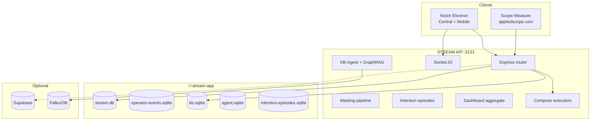

# Applied Scope — STREAM / Notch

**One desktop work surface for FDEs and AEs.** Notch pulls Gmail, Slack, Monday, calendar, and AI tools into a single feed, runs actions from natural language (`@monday`, `@meet`, `@mind`), captures how you actually work (for training better copilots), and builds a personal knowledge graph as you go.

| Piece | What it is |
|-------|------------|
| **Notch** | macOS Electron app — where you work |
| **STREAM API** | Local Express server (`:3131`) — integrations, KB, meetings, telemetry |
| **Scope Measure** | Web ops console at [appliedscope.com](https://appliedscope.com) — live stats on everything Notch captures |

Everything defaults to **local-first SQLite** under `~/.stream-app`. Optional cloud backup goes to **Supabase**; optional property graph to **FalkorDB**.

---

## Table of contents

1. [What problem this solves](#what-problem-this-solves)
2. [Product tour — Notch desktop](#product-tour--notch-desktop)
3. [Compose & natural language actions](#compose--natural-language-actions)
4. [Meetings & live calls](#meetings--live-calls)
5. [Knowledge graph (Mind)](#knowledge-graph-mind)
6. [Scope Measure (web dashboard)](#scope-measure-web-dashboard)
7. [Architecture](#architecture)
8. [Quick start](#quick-start)
9. [Production: Measure + Cloudflare tunnel](#production-measure--cloudflare-tunnel)
10. [What we collect & store](#what-we-collect--store)
11. [Integrations](#integrations)
12. [Repo structure](#repo-structure)
13. [APIs](#apis)
14. [Troubleshooting](#troubleshooting)
15. [Hosting & deployment](#hosting--deployment)
16. [Environment variables](#environment-variables)
17. [Related docs](#related-docs)

---

## What problem this solves

Forward Deployed Engineers and account execs live in **twelve tabs**: Gmail, Slack, Monday, Google Meet, LinkedIn, Claude, Cursor, Gong, Cal.com… Context fragments. Actions happen in silos. Nothing records *how* a good operator moves from signal → decision → action.

STREAM / Notch aims to:

| Goal | How |
|------|-----|
| **Single work surface** | Unified feed + calendar rail + embedded browser + Home chat |
| **Do work in place** | `@provider` compose routes to Gmail, Monday, Meet, Cursor, etc. |
| **Meeting → action** | Live transcript, signals, starred moments, post-call extraction |
| **Personal memory** | KB ingests feed + compose; ontology extracts deals, requirements, blockers |
| **Train better models** | Operator events, intention episodes, FDE corpus, action traces |
| **Observe everything** | Scope Measure shows counts, episodes, and live activity without opening Notch |

You do not need Mem0 or a separate memory product for the graph — entities, edges, and datapoints live in `kb.sqlite` and are visualized in **Mind → Knowledge graph**.

---

## Product tour — Notch desktop

Run: `npm run dev:notch:live` (or `npm run restart:notch`).

Notch is **desktop-only** for the product shell. Do not use the browser for Central UX — Electron loads `localhost:5174/central.html`.

### Layout (compact enterprise density)

```
┌──────────┬─────────────────────┬──────────────────────────┬─────────────┐
│ Side nav │ Home rail (optional)│ Main workspace           │ Dock rail   │
│          │ Chat history        │ Feed / Home chat /       │ Calendar    │
│ Home     │ Browser tabs        │ Browser / Build          │ Agent       │
│ Feed     │ Pinned apps         │                          │ Context     │
│ Notes    │                     │                          │ Stream      │
│ Mind     │                     │                          │             │
│ Build    │                     │                          │             │
│ Apps     │                     │                          │             │
│ Settings │                     │                          │             │
└──────────┴─────────────────────┴──────────────────────────┴─────────────┘
```

### Side navigation

| Page | Purpose |
|------|---------|
| **Home** | Chat with Notch; starter prompts; running agents panel; optional left rail for chat history + browser tabs |
| **Feed** | Integration stream (Gmail, Slack, Monday, LinkedIn, …) with compose bar and thread blade |
| **Notes** | Capture & reminders (Obsidian-style profiles) |
| **Mind** | **Knowledge graph explorer** — force-directed Neo4j-style viz of entities, relations, and memories |
| **Build Dojo** | Agent builds: Cursor local/cloud, Claude Code CLI, run history, monitor |
| **Apps** | Connect OAuth integrations (Gmail, Slack, Monday, …) |
| **Settings** | Theme, account, prefs |

### Home

- **Good evening** welcome + starter cards (priorities, calendar prep, Monday summary, next call prep).
- **Message Notch…** composer — same NLP routing as feed (e.g. “start a meeting with @nikhil tomorrow at 3pm”).
- **Running agents** — multitask panel when builds or actions are in flight.
- **Workspace rail** — chat sessions, temp browser tabs (Meet, Docs, LinkedIn), pinned apps.

### Feed

- **For you / Signals** tabs, stream filters, search.
- **Compose** — `@monday`, `@gmail`, `@meet`, `@mind`, `@cursor`, etc.
- **Feed cards** — source avatars, threads (Gmail/Monday), calendar invite cards, agent proposals.
- **Context selection** — pick a feed item as compose context for Monday/Gmail actions.

### Dock rail (right)

Configurable widgets: **Calendar** (happening now, join Meet), **Agent** (LinkedIn-style proposals), **Chat** (page-aware assist), **Context** (recent KB datapoints by intention), **Stream** (mini feed + compose).

Meeting toasts notify when a call is starting — **Join** opens Meet externally; the app does **not** hijack your browser on refresh.

### Build Dojo

- Cursor **local** (CLI/subscription via `@cursor local ask:`) and **cloud** agents.
- Claude Code runs via CLI executor (not raw Anthropic API for build loops).
- Run cards, logs, thread history per project.

### Mobile cluster (optional)

Separate Electron droplet below the Mac notch — ambient assist during calls. Toggle with **⌘⇧M**. Hotkeys: **⌘⇧L** start meeting, **⌘⇧K** end, **⌘⇧S** star moment.

---

## Compose & natural language actions

Type in Feed or Home compose. Commands use `@provider` syntax or natural language where supported.

### Examples

```
@monday create: Follow up with Acme on SOC2 timeline
@gmail reply: Thanks — looping in legal
@meet with @apoorva tomorrow at 3pm
start a meeting with @nikhil right now on google meet
@mind remember: customer wants Frankfurt residency for Q3 launch
@cursor local ask: fix the auth redirect in notch/electron
@calcom book June 15 2pm guests are client@co.com
@claude ask: draft a scope email for the Shopify integration
```

### Meet scheduling (NLP)

Detected automatically when text looks like scheduling:

- `@meet with @name …`
- `schedule a google meet with @name …`
- `start a meeting with @name right now`

**Requirements:**

1. Gmail connected in **Apps** with calendar scope (reconnect once if invites fail).
2. Contacts synced (**Apps → Gmail → sync contacts**) so `@name` resolves to email.
3. Guest must not be your own connected Gmail (Google won’t email yourself).

Creates a Google Calendar event + Meet link, sends calendar invite + backup Gmail with link.

### Compose providers

| Provider | Examples |
|----------|----------|
| `monday` | create, comment, board NLP |
| `gmail` | reply, send |
| `meet` / `gmeet` | schedule Meet + invite |
| `slack`, `discord`, `x` | post |
| `gdocs` | create, append |
| `calcom` | book |
| `claude`, `gemini`, `perplexity` | ask / research |
| `cursor` | local ask, cloud ask |
| `github` | issues, comments |
| `gong` | call notes |
| `obsidian` | append to vault |
| `mind` | append to personal KB |

Executor registry: `server/integrations/executors/index.ts`.

---

## Meetings & live calls

1. **Calendar rail** — upcoming events, “Happening now”, Join Meet.
2. **Toasts** — 15m / 5m / live reminders (Join + Open, no forced tab on refresh).
3. **Live pipeline** (`NOTCH_PROTOTYPE=1`) — audio tap → transcript → signals → assist suggestions.
4. **Starred moments** — flag highlights during call (**⌘⇧S**).
5. **Post-call** — extraction to requirements, decisions, Google Doc notes, Monday tasks.

Meeting data feeds the **FDE training corpus** (chunks, signals, predictions, decisions) and **intention episodes**.

---

## Knowledge graph (Mind)

As you use Notch, the KB pipeline (`server/kb/pipeline.ts`) ingests:

- Stream items (Gmail, Slack, Monday, …)
- `@mind` consciousness notes
- Compose **action traces** (provider, latency, outcome)
- Meeting text

**Ontology** (`config/kb-ontology.json`) extracts typed entities: customer, deal, requirement, blocker, compliance_rule, integration, timeline, budget_signal — and relations like `has_requirement`, `blocked_by`, `part_of_deal`.

### Mind → Knowledge graph UI

- Force-directed graph (entities + memory nodes + directed edges).
- Filter, inspect connections, toggle memory nodes.
- API: `GET /kb/graph`

**Storage:** `~/.stream-app/kb.sqlite` — tables `kb_entities`, `kb_edges`, `kb_datapoints`, `kb_traces`.

Optional **FalkorDB** mirror for Cypher queries and feed ranking — see [Docker](#docker-falkordb-optional).

---

## Scope Measure (web dashboard)

**URL:** [https://appliedscope.com](https://appliedscope.com) (also `/measure` locally)

Browser ops console — **not** part of the Electron app. Answers: *what is being measured right now?*

### Sections

| Section | Shows |
|---------|--------|
| **Overview counts** | Stream items, operator events, KB entities/edges, meetings, FDE corpus, agents |
| **Intention episodes** | Behavioral weight, reaction speed, event chains, outcomes |
| **Insights** | Stream by source, compose intention mix, engagements, task sessions |
| **Moments** | Starred moments, meeting signals, recent meetings |
| **Live activity** | Real-time event feed (Socket.IO + polling) |

### How Measure reaches your Mac

```
Notch (:3131)  →  Cloudflare Tunnel  →  api.appliedscope.com  →  Vercel BFF  →  appliedscope.com
```

Measure never talks to your laptop directly from the browser — Vercel proxies to `STREAM_API_URL` with `MEASURE_API_SECRET`.

---

## Architecture



**Data flow:**

1. Integrations sync → `stream.db` → auto-ingest → `kb.sqlite`.
2. UI emits operator events → intention engine → episodes → dashboard.
3. Compose → action traces + provider executors.
4. Meetings → FDE training tables + signals.
5. Measure aggregates on read — no separate snapshot DB.

---

## Quick start

### Prerequisites

- **Node.js** 20+
- **macOS** for Notch Electron (primary target)
- OAuth keys in `.env.local` (copy from `.env.example`)

### Install & run Notch

```bash
git clone <repo>
cd stream-app
npm install
cp .env.example .env.local   # fill Gmail, Monday, etc. as needed

npm run dev:notch:live         # API :3131 + Vite :5174 + Electron
```

| Command | Use case |
|---------|----------|
| `npm run dev:notch:live` | **Recommended** — real OAuth, live meeting pipeline |
| `npm run dev:notch:demo` | Acme simulation + canned assist |
| `npm run restart:notch` | Stop + restart live stack |
| `npm run dev:api` | API only |
| `npm run dev:web` | Next.js only (needs API running) |

### First-time setup in Notch

1. **Apps** → connect **Gmail** (enables feed + calendar + contacts + Meet).
2. Connect **Monday**, **Slack**, etc. as needed.
3. **Apps → Gmail** → sync contacts (for `@name` in Meet compose).
4. Use **Feed** or **Home** — items appear in stream and KB.
5. Open **Mind** — watch the graph grow.

Local Measure (dev): [http://localhost:3000/measure](http://localhost:3000/measure) with `npm run dev:web` + API on `:3131`.

---

## Production: Measure + Cloudflare tunnel

For [appliedscope.com](https://appliedscope.com) to show live data, **two things** must run on your Mac:

```bash
# Terminal 1 — Notch + API
npm run dev:notch:live

# Terminal 2 — tunnel (after one-time setup)
npm run tunnel:api:prod
```

### One-time tunnel setup

```bash
brew install cloudflared          # if needed
npm run setup:stream-tunnel       # Cloudflare login, DNS for api.appliedscope.com
npm run sync:measure-vercel       # point Vercel STREAM_API_URL at tunnel
npm run install:stream-tunnel-agent   # optional: auto-start tunnel at login
```

### Verify

```bash
npm run verify:stream-tunnel
# ✓ Local API: HTTP 200
# ✓ Public tunnel: HTTP 200
```

Then refresh appliedscope.com.

See [measure-site/README.md](measure-site/README.md) for Vercel env vars (`STREAM_API_URL`, `MEASURE_API_SECRET`, Google OAuth for login).

---

## What we collect & store

Default directory: `~/.stream-app` (override: `STREAM_DATA_DIR`).

| File | Contents |
|------|----------|
| `stream.db` | Unified feed items from all integrations |
| `kb.sqlite` | KB entities, edges, datapoints, action traces, **FDE training tables** |
| `operator-events.sqlite` | UI telemetry (impression, dwell, compose, nav, meetings) |
| `intention-episodes.sqlite` | Behavioral intention episodes (chains, latencies, outcomes) |
| `agent.sqlite` | Agent proposals (e.g. LinkedIn booking flows) |
| OAuth token stores | Per-integration, under data dir |

### Operator events (sample)

`feed_impression`, `feed_dwell`, `feed_context_select`, `compose_start`, `compose_submit`, `meeting_start`, `meeting_end`, `nav_change`, `agent_proposal_*` — see `shared/operator-events.ts`.

### Intention episodes

Derived from events: reaction speed, commitment depth, behavioral weight, text intention vector (explore / plan / execute / reflect / defer). Engine: `server/intention/episodeEngine.ts`.

### Supabase backup (optional)

Migrations in `supabase/migrations/`. Auto-sync operator events + intention episodes + post-meeting corpus. Disable: `SUPABASE_SYNC_DISABLED=1`.

---

## Integrations

Connect in **Notch → Apps**.

| Integration | Feed | Compose | Auth |
|-------------|------|---------|------|
| Gmail + Calendar + Contacts | ✓ | reply, send | Google OAuth |
| Google Docs | — | create, append | Google OAuth |
| Google Meet scheduling | — | `@meet`, NLP | Google OAuth |
| Slack | ✓ | send | OAuth + app token |
| Monday.com | ✓ | create, NLP | API token |
| X (Twitter) | ✓ | post | OAuth 2 |
| Discord | — | send | Bot token |
| GitHub | ✓ | issues | PAT |
| Gong | ✓ | notes | API key |
| Cal.com | ✓ | book | API key |
| Claude | — | ask | API key / OAuth |
| Gemini | — | ask | API key |
| Perplexity | — | research | API key |
| Cursor | — | local/cloud ask | API key / SDK |
| Obsidian | — | append | Local vault path |
| LinkedIn | embed | compose assist | Session cookies |

---

## Repo structure

```
stream-app/
├── notch/                 # Electron desktop app
│   ├── electron/          # Main process, audio tap, hotkeys
│   └── src/central/       # Central UI (Feed, Home, Mind, Build, …)
├── server/                # STREAM API
│   ├── router.ts          # HTTP routes
│   ├── cluster/           # Meeting pipeline, stream bootstrap
│   ├── kb/                # Personal KB, ontology, graph snapshot
│   ├── integrations/      # Compose executors
│   ├── sources/           # Gmail, Slack, Monday, Meet, …
│   ├── dashboard/         # Measure aggregates
│   ├── intention/         # Episode engine
│   ├── fde/               # Training corpus, engagements
│   └── graph/             # FalkorDB sync
├── shared/                # Types shared client ↔ server
├── measure-site/          # Scope Measure Next.js app (appliedscope.com)
├── app/                   # Legacy Next.js routes (download, etc.)
├── config/
│   ├── kb-ontology.json   # Entity/relation extract rules
│   └── cloudflared.yml    # Tunnel config (after setup)
├── supabase/migrations/   # Cloud schema
└── docs/                  # FDE handoff, release, specs
```

Key UI entry: `notch/src/central/CentralApp.tsx`  
Key API entry: `server/index.ts` → `server/router.ts`

---

## APIs

Base: `http://localhost:3131`

### Core

| Method | Path | Description |
|--------|------|-------------|
| GET | `/health` | Health check |
| GET | `/stream` | Recent feed items |
| POST | `/sync/all` | Trigger integration syncs |
| GET | `/connections` | OAuth status |

### Compose & KB

| Method | Path | Description |
|--------|------|-------------|
| POST | `/cluster/action` | Run `@provider` command |
| GET | `/kb/context` | GraphRAG retrieval |
| GET | `/kb/graph` | Graph snapshot for Mind UI |
| GET | `/kb/stats` | Counts + recent datapoints |
| POST | `/kb/stream` | Ingest consciousness text |

### Dashboard (Measure)

| Method | Path | Description |
|--------|------|-------------|
| GET | `/dashboard/data` | Full snapshot (`?since=` incremental) |

### Training & telemetry

| Method | Path | Description |
|--------|------|-------------|
| POST | `/telemetry/events` | Batch operator events |
| GET | `/training/dataset` | FDE training export |
| POST | `/training/sync` | Push to Supabase |

### Realtime (Socket.IO)

| Event | Purpose |
|-------|---------|
| `stream:item` | New/updated feed item |
| `dashboard:activity` | Measure live feed |
| `dashboard:episode` | Intention episode closed |
| Cluster events | Transcript, signals, assist |

Full routes: `server/router.ts`.

---

## Troubleshooting

### Scope Measure shows HTTP 530

**Cause:** Cloudflare tunnel not running, or API down on `:3131`.

```bash
lsof -i :3131                    # should show node
npm run dev:notch:live           # start API
npm run tunnel:api:prod          # start tunnel
npm run verify:stream-tunnel     # both should be ✓
```

530 = “DNS works, nothing behind tunnel”. 401 = auth mismatch (`MEASURE_API_SECRET`).

### Meet invite not received

1. Reconnect Gmail in Apps (needs `calendar.events` scope).
2. Sync contacts — `@name` must resolve to real email.
3. Check success message for exact recipient email.
4. Don’t schedule with yourself as only guest.

### Calendar opens Meet on every refresh

Fixed: live meetings toast only; no auto-focus browser tab on reload.

### `better-sqlite3` / Electron module version error

```bash
npm rebuild better-sqlite3
npx @electron/rebuild -f -w better-sqlite3
```

### Graph empty in Mind

Use the app — feed sync, `@mind` notes, compose actions populate KB. Run `@mind` or wait for feed auto-ingest. Check `GET /kb/stats`.

---

## Docker (FalkorDB, optional)

**Only** for optional property graph — not required for Notch, feed, or Measure.

```bash
docker compose -f docker-compose.falkordb.yml up -d
```

```env
FALKORDB_URL=redis://localhost:6380
FALKORDB_GRAPH=notch
FALKORDB_ENABLED=1
```

SQLite remains source of truth; FalkorDB is a sync target for Cypher queries and feed ranking.

---

## Hosting & deployment

| Component | Host | Notes |
|-----------|------|-------|
| **Scope Measure** | Vercel (`appliedscope.com`) | BFF proxies to `STREAM_API_URL` |
| **STREAM API tunnel** | Cloudflare → your Mac `:3131` | `npm run tunnel:api:prod` |
| **Notch desktop** | GitHub Releases / S3 | `npm run pack:notch:mac` |
| **Supabase** | Supabase Cloud | Optional backup |
| **FalkorDB** | Docker local or Cloud | Optional graph |

Release docs: [docs/NOTCH_RELEASE.md](docs/NOTCH_RELEASE.md)

---

## Environment variables

Copy `.env.example` → `.env.local`.

| Variable | Purpose |
|----------|---------|
| `PORT` | API port (default `3131`) |
| `STREAM_DATA_DIR` | Override `~/.stream-app` |
| `APP_URL` | OAuth redirect base |
| `SESSION_SECRET` | Session signing |
| `SIMULATION_MODE` / `DEMO_MODE` | Demo vs live |
| `NOTCH_PROTOTYPE=1` | Live meeting pipeline |
| `MEASURE_API_SECRET` | Measure ↔ API auth |
| `ANTHROPIC_API_KEY`, `GEMINI_API_KEY` | LLM features |
| `SUPABASE_*` | Cloud backup |
| `FALKORDB_*` | Property graph |
| `GMAIL_*`, `SLACK_*`, … | Per-integration OAuth |

---

## Related docs

| Doc | Topic |
|-----|-------|
| [notch/README.md](notch/README.md) | Desktop shortcuts, dev URLs |
| [measure-site/README.md](measure-site/README.md) | Measure Vercel + tunnel setup |
| [docs/FDE_HANDOFF.md](docs/FDE_HANDOFF.md) | Production FDE onboarding |
| [docs/NOTCH_RELEASE.md](docs/NOTCH_RELEASE.md) | macOS build + download page |
| [STREAM_SPEC_V2.md](STREAM_SPEC_V2.md) | Product spec |
| [MEETING_INTELLIGENCE_SPEC.md](MEETING_INTELLIGENCE_SPEC.md) | Meeting pipeline design |

---

## Scripts cheat sheet

```bash
npm run dev:notch:live       # Notch + API (daily driver)
npm run restart:notch        # Hard restart
npm run dev:notch:live:stream # Notch + API + tunnel
npm run tunnel:api:prod      # Cloudflare tunnel only
npm run verify:stream-tunnel # Health check local + public
npm run pack:notch:mac       # Build .dmg
npm run typecheck            # TypeScript
```

---

## License

Private — Applied Scope / internal use.
